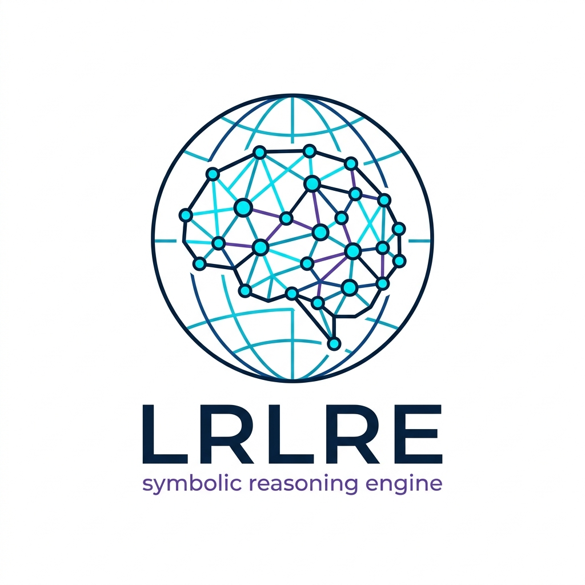
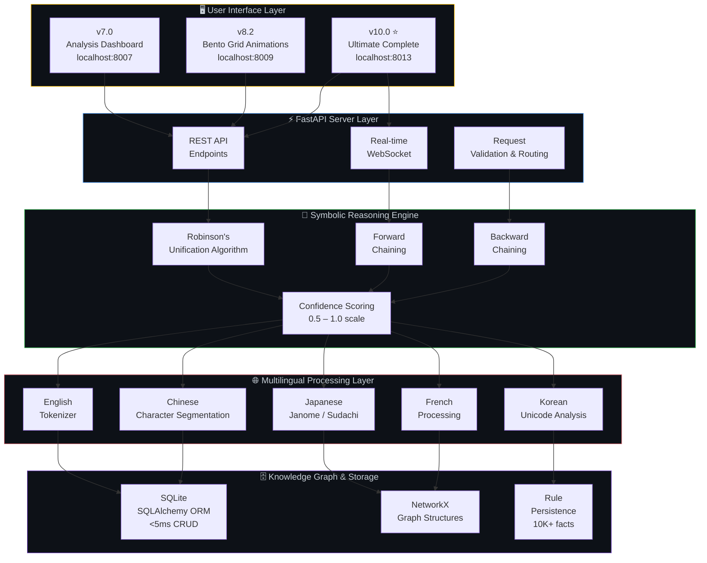
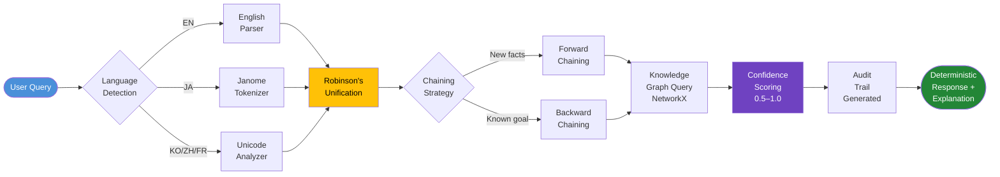
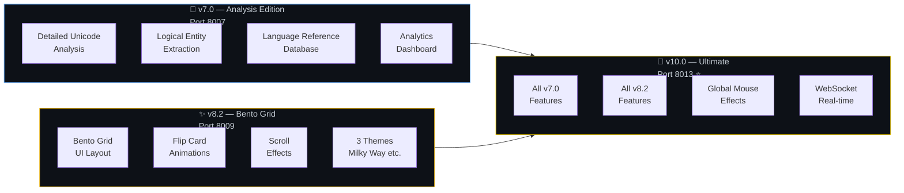
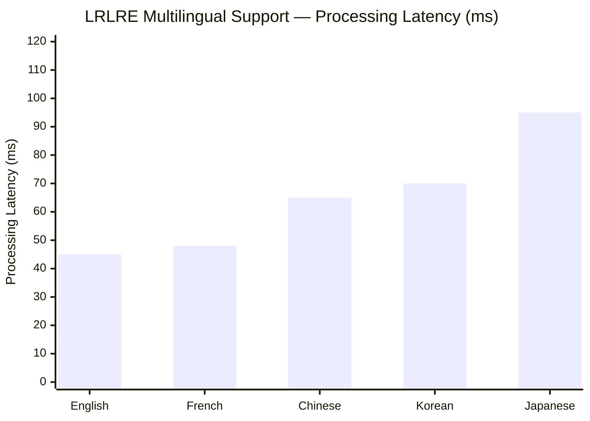

<div align="center">



# 🚀 LRLRE

### Low-Resource Language Reasoning Engine

**Enterprise-grade symbolic NLP reasoning system for edge environments.**

**100% Symbolic · 0% Neural · 100% Explainable · 100% Deterministic**

[](https://python.org)
[](https://fastapi.tiangolo.com)
[](LICENSE.md)
[](https://github.com/Ariyan-Pro/lrlre/releases)
[]()
[]()
[]()
[]()

[🚀 Quick Start](#-quick-start) · [🧠 Architecture](#-architecture) · [📊 Three Versions](#-three-production-ready-versions) · [🌐 Multilingual](#-multilingual-support) · [🐛 Issues](https://github.com/Ariyan-Pro/lrlre/issues)

</div>

---

## 🎯 What Is LRLRE?

Most NLP systems today require large language models, GPU infrastructure, and cloud connectivity. LRLRE proves none of that is necessary for high-quality language reasoning.

**LRLRE is a 100% symbolic NLP reasoning engine** — built on Robinson's unification, Forward/Backward Chaining inference, and NetworkX knowledge graphs. It runs on a Raspberry Pi. It supports 5 languages. It never hallucinates. Every inference is deterministic, explainable, and auditable.

> **100% Symbolic · 0% Neural · No LLMs · No GPU · No Cloud Required**

---

## ⚡ Performance

<div align="center">

| Metric | Value | Context |
|:-------|:------|:--------|
| **CRUD Operations** | **< 5ms** | SQLite + SQLAlchemy ORM |
| **Complex Reasoning Cycles** | **50–100ms** | Forward/Backward Chaining |
| **Concurrent Users** | **100+ verified** | WebSocket + FastAPI |
| **Knowledge Capacity** | **10,000+ facts/rules** | NetworkX graph storage |
| **Memory Footprint** | **< 100MB** | Edge deployment optimized |
| **Languages Supported** | **5** | EN · JA · KO · ZH · FR |

</div>

---

## ✨ Features

- **🧠 100% Symbolic Reasoning** — No LLMs, no neural models, no probabilistic approximation. Every inference follows an explicit, auditable rule chain.
- **🔄 Deterministic Inference** — Robinson's Unification Algorithm combined with Forward and Backward Chaining. Same input always produces the same output.
- **🌐 Multilingual Processing** — English, Japanese (Janome/Sudachi), Korean, Chinese (Unicode character analysis), and French — all handled by a unified processing layer.
- **📊 Three Dashboard Versions** — v7.0 analysis-first, v8.2 animation-first (Bento Grid), v10.0 combined ultimate edition. Choose your deployment style.
- **⚡ Edge-Optimized** — < 100MB memory footprint. Runs on constrained hardware without cloud connectivity.
- **🕸️ Knowledge Graph Architecture** — NetworkX graph structures with SQLite persistence. Supports 10,000+ facts and rules with < 5ms CRUD latency.
- **📡 Real-Time WebSocket** — Live inference updates pushed to the dashboard without polling.
- **🎨 Enterprise UI** — Interactive Bento Grid, flip card animations, multiple themes (Milky Way, Quantum Blue, Sunset), global mouse effects.

---

## 📊 Three Production-Ready Versions

| Version | Codename | Entry Point | Port | Best For |
|:--------|:---------|:------------|:-----|:---------|
| **v7.0** | 🧠 Analysis Edition | `start_analytics_v7.py` | 8007 | Detailed Unicode, logical, entity analysis |
| **v8.2** | ✨ Bento Grid | `start_analytics_v8_bento_grid.py` | 8009 | Animations, flip cards, scroll effects |
| **v10.0** | 💎 Ultimate Complete | `ultimate_v10_fixed.py` | 8013 | Everything combined ← **Recommended** |

---

## 🧠 Architecture

### Mermaid Diagrams — Paste at [mermaid.live](https://mermaid.live) to Render & Export

> 💡 Copy any block → paste at **[mermaid.live](https://mermaid.live)** → Export PNG/SVG instantly.

---

#### Diagram 1 — 5-Layer System Architecture



---

#### Diagram 2 — Symbolic Inference Pipeline (Query to Answer)



---

#### Diagram 3 — Three Dashboard Version Comparison



---

#### Diagram 4 — Multilingual Processing Coverage



---

## 📉 Generate Charts Locally (Matplotlib + PowerShell)

> 💡 Run the PowerShell setup block first, then copy each script into `charts/` and execute.

### PowerShell — Setup

```powershell
# Clone and enter repo
git clone https://github.com/Ariyan-Pro/lrlre.git
Set-Location lrlre

# Create and activate virtual environment
python -m venv venv
.\venv\Scripts\Activate.ps1

# Install dependencies
pip install -r requirements.txt
pip install matplotlib numpy

# Create charts directory
New-Item -ItemType Directory -Force -Path charts

# Verify
python -c "import matplotlib; print('Matplotlib:', matplotlib.__version__)"
```

---

### Chart 1 — Performance Benchmarks (Multi-Metric)

```powershell
python charts/performance_benchmarks.py
Invoke-Item charts/performance_benchmarks.png
```

```python
# charts/performance_benchmarks.py
import matplotlib.pyplot as plt
import numpy as np

fig, axes = plt.subplots(1, 2, figsize=(13, 6))
fig.patch.set_facecolor('#0d1117')

# Left — Latency comparison
ax1 = axes[0]
ax1.set_facecolor('#161b22')
operations = ['CRUD\nOperations', 'Simple\nReasoning', 'Complex\nReasoning', 'Multilingual\nDetection']
latencies  = [5, 20, 100, 70]
colors     = ['#28a745', '#58a6ff', '#ffc107', '#e06c75']

bars = ax1.bar(operations, latencies, color=colors, width=0.55, zorder=3)
ax1.set_ylabel('Latency (ms)', color='#c9d1d9', fontsize=11)
ax1.set_title('LRLRE Operation Latencies\n(Lower is Better)', color='#c9d1d9', fontsize=12)
ax1.tick_params(colors='#c9d1d9')
ax1.spines[:].set_color('#30363d')
ax1.yaxis.grid(True, color='#30363d', alpha=0.5, zorder=0)
for bar, val in zip(bars, latencies):
    label = f'<{val}ms' if val in [5, 20] else f'{val}ms'
    ax1.text(bar.get_x() + bar.get_width() / 2, bar.get_height() + 1.5,
             label, ha='center', color='white', fontsize=10, fontweight='bold')

# Right — Capacity metrics
ax2 = axes[1]
ax2.set_facecolor('#161b22')
metrics  = ['Concurrent\nUsers', 'Knowledge\nCapacity\n(×100)', 'Confidence\nRange (%)']
values   = [100, 100, 50]   # 10K facts = 100×100, confidence 0.5-1.0 → 50%
colors2  = ['#ffd700', '#28a745', '#6f42c1']

bars2 = ax2.bar(metrics, values, color=colors2, width=0.45, zorder=3)
ax2.set_ylabel('Value', color='#c9d1d9', fontsize=11)
ax2.set_title('LRLRE Capacity Specifications\n(Higher is Better)', color='#c9d1d9', fontsize=12)
ax2.tick_params(colors='#c9d1d9')
ax2.spines[:].set_color('#30363d')
ax2.yaxis.grid(True, color='#30363d', alpha=0.5, zorder=0)
actual_labels = ['100+ users', '10,000+ facts', '0.5–1.0 scale']
for bar, label in zip(bars2, actual_labels):
    ax2.text(bar.get_x() + bar.get_width() / 2, bar.get_height() + 1.5,
             label, ha='center', color='white', fontsize=9, fontweight='bold')

plt.suptitle('LRLRE Enterprise Grid v13.0 — Performance Overview',
             color='#c9d1d9', fontsize=13, y=1.01)
plt.tight_layout()
plt.savefig('charts/performance_benchmarks.png', dpi=150, bbox_inches='tight',
            facecolor=fig.get_facecolor())
print("Saved: charts/performance_benchmarks.png")
```

---

### Chart 2 — Multilingual Processing Latency (Radar)

```powershell
python charts/multilingual_radar.py
Invoke-Item charts/multilingual_radar.png
```

```python
# charts/multilingual_radar.py
import matplotlib.pyplot as plt
import numpy as np

languages  = ['English', 'French', 'Chinese\n(ZH)', 'Korean\n(KO)', 'Japanese\n(JA)']
# Score = 100 - normalized_latency (higher = faster)
scores     = [100, 98, 85, 82, 75]

N = len(languages)
angles = [n / float(N) * 2 * np.pi for n in range(N)]
angles += angles[:1]
scores_plot = scores + scores[:1]

fig, ax = plt.subplots(figsize=(8, 8), subplot_kw=dict(polar=True))
fig.patch.set_facecolor('#0d1117')
ax.set_facecolor('#161b22')

ax.plot(angles, scores_plot, 'o-', linewidth=2.5, color='#ffc107', zorder=3)
ax.fill(angles, scores_plot, alpha=0.2, color='#ffc107')

ax.set_xticks(angles[:-1])
ax.set_xticklabels(languages, color='#c9d1d9', fontsize=11)
ax.set_ylim(0, 100)
ax.set_yticks([25, 50, 75, 100])
ax.set_yticklabels(['25', '50', '75', '100'], color='#8b949e', fontsize=8)
ax.grid(color='#30363d', linewidth=0.8)
ax.spines['polar'].set_color('#30363d')
ax.set_title('LRLRE Multilingual Processing Speed\n(Higher = Faster Processing)',
             color='#c9d1d9', fontsize=13, pad=22, y=1.08)

for angle, score, lang in zip(angles[:-1], scores, languages):
    ax.annotate(f'{score}', xy=(angle, score), xytext=(angle, score + 7),
                color='#ffd700', fontsize=10, fontweight='bold', ha='center')

plt.tight_layout()
plt.savefig('charts/multilingual_radar.png', dpi=150, bbox_inches='tight',
            facecolor=fig.get_facecolor())
print("Saved: charts/multilingual_radar.png")
```

---

### Chart 3 — Three Dashboard Versions Feature Comparison (Heatmap)

```powershell
python charts/version_comparison.py
Invoke-Item charts/version_comparison.png
```

```python
# charts/version_comparison.py
import matplotlib.pyplot as plt
import matplotlib.colors as mcolors
import numpy as np

fig, ax = plt.subplots(figsize=(12, 5))
fig.patch.set_facecolor('#0d1117')
ax.set_facecolor('#161b22')

versions = ['v7.0\nAnalysis', 'v8.2\nBento Grid', 'v10.0\nUltimate ⭐']
features = ['Unicode\nAnalysis', 'Entity\nExtraction', 'Bento Grid\nUI', 'Flip Card\nAnimations',
            'Multiple\nThemes', 'WebSocket\nReal-time', 'Mouse\nEffects', 'Analytics\nDashboard']

matrix = np.array([
    [1.0, 1.0, 0.0, 0.0, 0.5, 0.5, 0.0, 1.0],  # v7.0
    [0.5, 0.5, 1.0, 1.0, 1.0, 0.5, 0.5, 0.5],  # v8.2
    [1.0, 1.0, 1.0, 1.0, 1.0, 1.0, 1.0, 1.0],  # v10.0
])

cmap = mcolors.LinearSegmentedColormap.from_list(
    'lrlre', ['#161b22', '#1a4f1a', '#ffd700'], N=256)

im = ax.imshow(matrix, cmap=cmap, vmin=0, vmax=1, aspect='auto')
ax.set_xticks(range(len(features)))
ax.set_xticklabels(features, color='#c9d1d9', fontsize=9)
ax.set_yticks(range(len(versions)))
ax.set_yticklabels(versions, color='#c9d1d9', fontsize=11, fontweight='bold')
ax.set_title('LRLRE Dashboard Version Feature Matrix\nv10.0 Recommended — Complete Feature Set',
             color='#c9d1d9', fontsize=13, pad=12)
ax.tick_params(colors='#c9d1d9')

labels_map = {1.0: '✅ Full', 0.5: '⚡ Partial', 0.0: '—'}
for i in range(len(versions)):
    for j in range(len(features)):
        ax.text(j, i, labels_map[matrix[i, j]], ha='center', va='center',
                color='white', fontsize=8, fontweight='bold')

plt.colorbar(im, ax=ax, fraction=0.02, pad=0.02).set_label(
    'Feature Coverage', color='#c9d1d9', fontsize=9)
plt.tight_layout()
plt.savefig('charts/version_comparison.png', dpi=150, bbox_inches='tight',
            facecolor=fig.get_facecolor())
print("Saved: charts/version_comparison.png")
```

---

### Chart 4 — Tech Stack by Component Role

```powershell
python charts/tech_stack.py
Invoke-Item charts/tech_stack.png
```

```python
# charts/tech_stack.py
import matplotlib.pyplot as plt
import matplotlib.patches as mpatches

fig, ax = plt.subplots(figsize=(11, 6))
fig.patch.set_facecolor('#0d1117')
ax.set_facecolor('#161b22')

layers = ['Knowledge\nStorage', 'Language\nProcessing', 'Symbolic\nReasoning',
          'API\nServer', 'UI\nDashboard']
tech   = ['SQLite +\nNetworkX', 'Janome /\nSudachi', 'Robinson\nUnification +\nChaining',
          'FastAPI +\nUvicorn', 'HTML5 /\nChart.js']
colors = ['#6f42c1', '#e06c75', '#28a745', '#58a6ff', '#ffc107']
sizes  = [0.9, 0.85, 1.0, 0.95, 0.8]  # relative importance

y_pos = range(len(layers))
bars = ax.barh(y_pos, sizes, color=colors, height=0.55, zorder=3)

ax.set_yticks(y_pos)
ax.set_yticklabels(layers, color='#c9d1d9', fontsize=10)
ax.set_xlim(0, 1.4)
ax.set_xlabel('Relative Role Weight', color='#c9d1d9', fontsize=11)
ax.set_title('LRLRE Technology Stack — Component Breakdown\nv13.0 Enterprise Grid',
             color='#c9d1d9', fontsize=13, pad=12)
ax.tick_params(colors='#c9d1d9')
ax.spines[:].set_color('#30363d')
ax.xaxis.grid(True, color='#30363d', alpha=0.4, zorder=0)
ax.set_xticks([])

for bar, tech_name, color in zip(bars, tech, colors):
    ax.text(bar.get_width() + 0.02, bar.get_y() + bar.get_height() / 2,
            tech_name, va='center', color=color, fontsize=9, fontweight='bold')

plt.tight_layout()
plt.savefig('charts/tech_stack.png', dpi=150, bbox_inches='tight',
            facecolor=fig.get_facecolor())
print("Saved: charts/tech_stack.png")
```

---

## 🚀 Quick Start

### PowerShell — Setup (Windows + WSL2)

```powershell
# Clone repository
git clone https://github.com/Ariyan-Pro/lrlre.git
Set-Location lrlre

# Create virtual environment
python -m venv venv
.\venv\Scripts\Activate.ps1

# Install dependencies
pip install -r requirements.txt

# Initialize knowledge database
python -c "from lrlre.symbols.persistence import init_db; init_db()"
```

### Launch Dashboard (PowerShell)

```powershell
# Option 1 — v7.0 Analysis Edition (port 8007)
python start_analytics_v7.py
Start-Process "http://localhost:8007"

# Option 2 — v8.2 Bento Grid Animations (port 8009)
python start_analytics_v8_bento_grid.py
Start-Process "http://localhost:8009"

# Option 3 — v10.0 Ultimate Complete (port 8013) ← RECOMMENDED
python ultimate_v10_fixed.py
Start-Process "http://localhost:8013"

# Or use the included batch launcher
.\LAUNCH_LRLRE.bat

# Or the PowerShell launcher
.\LAUNCH_LRLRE.ps1

# Or create a desktop shortcut
.\CREATE_DESKTOP_SHORTCUT.ps1
```

### Test Inference (PowerShell)

```powershell
# Test multilingual language detection
$body = @{ text = "Hello, how are you?" } | ConvertTo-Json
Invoke-RestMethod -Uri "http://localhost:8013/detect" `
                  -Method Post -ContentType "application/json" -Body $body

# Test symbolic reasoning
$body = @{ query = "Is Socrates mortal?" } | ConvertTo-Json
Invoke-RestMethod -Uri "http://localhost:8013/reason" `
                  -Method Post -ContentType "application/json" -Body $body

# Test Japanese input
$body = @{ text = "人工知能とは何ですか？" } | ConvertTo-Json
Invoke-RestMethod -Uri "http://localhost:8013/detect" `
                  -Method Post -ContentType "application/json" -Body $body

# Health check
Invoke-RestMethod -Uri "http://localhost:8013/health" -Method Get
```

### Run Tests (PowerShell)

```powershell
# Language detection tests
python -m pytest tests/test_language_detection.py -v

# Inference engine tests
python -m pytest tests/test_inference.py -v

# Full test suite
python -m pytest tests/ -v --tb=short
```

---

## 🏭 Production Deployment

### Gunicorn (Linux / macOS)

```bash
# Deploy v7.0
gunicorn -w 4 -k uvicorn.workers.UvicornWorker start_analytics_v7:app

# Deploy v10.0 (recommended)
gunicorn -w 4 -k uvicorn.workers.UvicornWorker ultimate_v10_fixed:app --bind 0.0.0.0:8013
```

### Docker (PowerShell)

```powershell
# Build image
docker build -t lrlre-enterprise:v13.0 .

# Run v10.0 Ultimate
docker run -d -p 8013:8013 --name lrlre lrlre-enterprise:v13.0

# Or use Docker Compose
docker-compose up -d

# Check logs
docker logs -f lrlre

# Open dashboard
Start-Process "http://localhost:8013"
```

### Nginx Reverse Proxy

The repo includes a pre-configured `nginx.conf` for production reverse proxy:

```bash
# Apply nginx config (Linux)
sudo cp nginx.conf /etc/nginx/sites-available/lrlre
sudo ln -s /etc/nginx/sites-available/lrlre /etc/nginx/sites-enabled/
sudo nginx -t && sudo systemctl reload nginx
```

---

## 🎯 Key Technologies

<div align="center">

| Technology | Purpose | Version |
|:-----------|:--------|:--------|
| **FastAPI** | Web framework & WebSocket server | 0.104.1 |
| **SQLAlchemy** | Database ORM (SQLite backend) | 2.0.23 |
| **NetworkX** | Knowledge graph structures | 3.6.1 |
| **Pydantic** | Data validation & schema enforcement | 2.12.5 |
| **Uvicorn** | ASGI server | 0.24.0 |
| **Janome / Sudachi** | Japanese morphological analysis | Latest |
| **Chart.js** | Dashboard visualizations | CDN |
| **Font Awesome** | UI icons | CDN |

</div>

---

## 🌐 Multilingual Support

| Language | Code | Tokenizer | Unicode Range | Notes |
|:---------|:-----|:----------|:-------------|:------|
| **English** | EN | Whitespace + regex | ASCII | Baseline, fastest |
| **French** | FR | Whitespace + diacritics | Latin Extended | Accent-aware |
| **Chinese** | ZH | Character segmentation | U+4E00–U+9FFF | CJK unified |
| **Korean** | KO | Unicode analysis | U+AC00–U+D7A3 | Hangul syllables |
| **Japanese** | JA | Janome + Sudachi | U+3040–U+30FF + Kanji | Most complex, full morphology |

---

## 📁 Project Structure

```
lrlre/
├── logo.png                              # Project logo
├── start_analytics_v7.py                 # v7.0 — Analysis dashboard (port 8007)
├── start_analytics_v8_bento_grid.py      # v8.2 — Bento Grid UI (port 8009)
├── ultimate_v10_fixed.py                 # v10.0 — Ultimate Complete (port 8013) ⭐
├── v10_wrapper.py                        # v10.0 wrapper utility
│
├── lrlre/                                # Core engine modules
│   ├── multilingual/                     # Language detection & processing
│   ├── inference/                        # Robinson's unification + chaining
│   ├── symbols/                          # Knowledge graph & SQLite persistence
│   └── syntax/                           # Grammar parsing
│
├── configs/                              # System configuration files
├── data/                                 # Knowledge database & rule files
├── benchmarks/                           # Performance benchmark scripts
├── results/                              # Benchmark output and reports
├── tests/                                # Test suite
│   ├── test_language_detection.py
│   └── test_inference.py
│
├── bin/                                  # Binary utilities
├── LAUNCH_LRLRE.bat                      # Windows batch launcher
├── LAUNCH_LRLRE.ps1                      # PowerShell launcher
├── CREATE_DESKTOP_SHORTCUT.ps1           # Desktop shortcut creator
├── start_lrlre.bat                       # Alternative batch launcher
├── Dockerfile                            # Docker image definition
├── docker-compose.yml                    # Docker Compose stack
├── nginx.conf                            # Production reverse proxy config
├── pyproject.toml
├── requirements.txt
└── LICENSE.md
```

---

## 🤖 AI & Model Transparency

- **Model Type**: 100% Symbolic (rule-based) — no neural weights, no training data, no probabilistic outputs
- **Inference Method**: Robinson's Unification + Forward/Backward Chaining — fully deterministic
- **External APIs**: None — fully local, no cloud connectivity required
- **Hallucination Risk**: Zero — symbolic systems only produce outputs derivable from the explicit knowledge base
- **Explainability**: Every inference produces a complete audit trail showing the exact rule chain used
- **Confidence Scoring**: 0.5–1.0 scale based on rule chain depth and knowledge base coverage
- **Known Limitations**: Requires manual knowledge base construction. Cannot generalize beyond explicitly defined rules and facts.

---

## 🤝 Contributing

```powershell
# Fork and create feature branch
git checkout -b feature/AmazingFeature

# Make changes, add tests
python -m pytest tests/ -v

# Commit and push
git commit -m "feat: Add AmazingFeature"
git push origin feature/AmazingFeature
# Open a Pull Request
```

---

## 📄 License

[MIT](LICENSE.md) © 2026 [Ariyan Pro](https://github.com/Ariyan-Pro)

---

## 🙏 Acknowledgments

- [FastAPI](https://fastapi.tiangolo.com/) — High-performance async web framework
- [SQLAlchemy](https://www.sqlalchemy.org/) — Robust database ORM
- [NetworkX](https://networkx.org/) — Knowledge graph structures
- [Janome](https://mocobeta.github.io/janome/) / [Sudachi](https://github.com/WorksApplications/Sudachi) — Japanese morphological analysis
- [Chart.js](https://www.chartjs.org/) — Dashboard visualizations
- [Font Awesome](https://fontawesome.com/) — UI icons

---

<div align="center">

**100% Symbolic · 0% Neural · 100% Explainable**

*Built with ❤️ by the LRLRE Project Team*

⭐ [Star on GitHub](https://github.com/Ariyan-Pro/lrlre) · 🐛 [Report Issue](https://github.com/Ariyan-Pro/lrlre/issues) · 🚀 [Latest Release](https://github.com/Ariyan-Pro/lrlre/releases)

</div>
